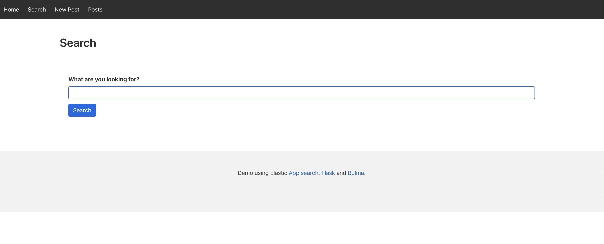
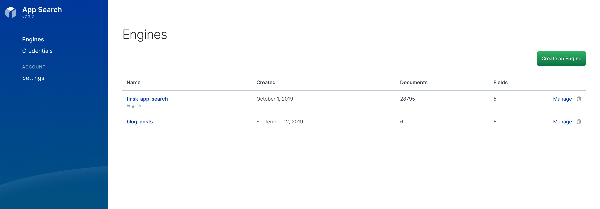
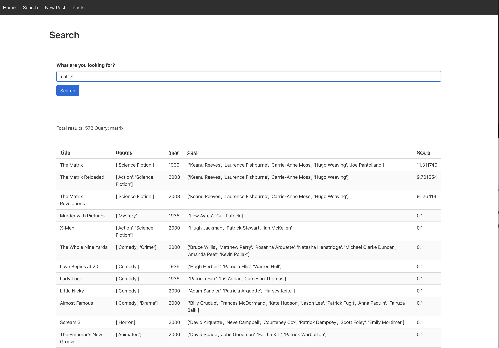

# Simple Search App
This is a Flask app using [Elasticsearch App Search](https://www.elastic.co/products/app-search) to search implementation.




## Setup: 
1. Setup your python Virtual environment (venv). [Doc on venv howto](https://packaging.python.org/guides/installing-using-pip-and-virtual-environments). 
    - Activate venv `source env/bin/activate` 
    - Install [requirements](requirements.txt) `pip install -r requirements.txt`
2. Start up Elastic app search `cd docker; docker-compose start` - first start of app search might take longer time
    - navigate to UI: `http://localhost:3002`
3. In App Search UI Create 2 new data engines for app-search and blog-posts.
    - Engine 1: `blog-posts`
    - Engine 2: `flask-app-search`
4. Import Movies dataset 
    - `cd ../data/movies`
    - configure and run `python index_movies.py`
    - let import all documents (28,795 docs)
5. Configure flask application
    - add your api key for `APP_SEARCH_API_KEY` in `flask-app-search/.env`
    - add your api key for `APP_SEARCH_API_KEY_BLOG` in `flask-app-search/.env`
6. Run application either using yor IDE or from command line in your venv `flask run`
7. Navigate to `http://127.0.0.1:5000/` to check your application. Go to [search](http://127.0.0.1:5000/search) page to start searching your movie dataset.

## App Search Installation:
Go to `docker` folder and execute `docker-compose start`

## Dataset:
The dataset is taken from [awesome-json-dataset](https://github.com/jdorfman/awesome-json-datasets#movies).

## Create Engines:
Follow the documentation to create 2 engines. `blog-posts` and `flask-app-search` using English language.
More in the [docu](https://swiftype.com/documentation/app-search/getting-started#engine)



## ETL: Data load
In order to index this dataset in to App search engine, we have to split the big file in to small chunks of size 100 due 
to restrictions on app search side. 

We will use script prepared for the task `index_movies.py` which will do the job for us. Just configure 2 variables and you are ready to go.
```bash
host_identifier = 'localhost:3002/api/as/v1'
api_key = 'private-yourkey'
```
- `cd data/movies`
- `python index_movies.py`
- let the import finish

Check for errors and if you have 28,795 docs in your `flask-app-search` engine.

## Flask app configuration
In order to configure properly the demo app, configure your engines api key. Navigate to `.env` file and change 
following lines with your api keys. You can choose different levels of access and by default, you will be fine with just 
one key which covers both engines. For the sake of demo, I created additional access api key for blog posts. 
```
APP_SEARCH_API_KEY='search-sm77kdfd3mvtdykg4pfvusiq'
APP_SEARCH_API_KEY_BLOG='private-7369ct1thtwppsq73s122zip'
```
Note, that if you are using HTTPS endpoint of Elastic SaaS or your own TLS endpoint for App Search, do not use protocol part (`https://`)
in configuration `APP_SEARCH_BASE_ENDPOINT='localhost:3002/api/as/v1'`. 

Configuration value of `APP_SEARCH_USE_HTTPS=True/False` will pick correct protocol.

## Run demo
To tun the application, you simply execute `flask run` command in your venv or use IDE of your choice to execute.
Then, navigate your browser to `http://127.0.0.1:5000/` and enjoy your app.





## **References:**

- [App Search](https://www.elastic.co/products/app-search) and download [Latest version](https://www.elastic.co/downloads/app-search)
- App Search [Documentation](https://swiftype.com/documentation/app-search/self-managed/overview)
- [Python app-search client](https://github.com/elastic/app-search-python) library